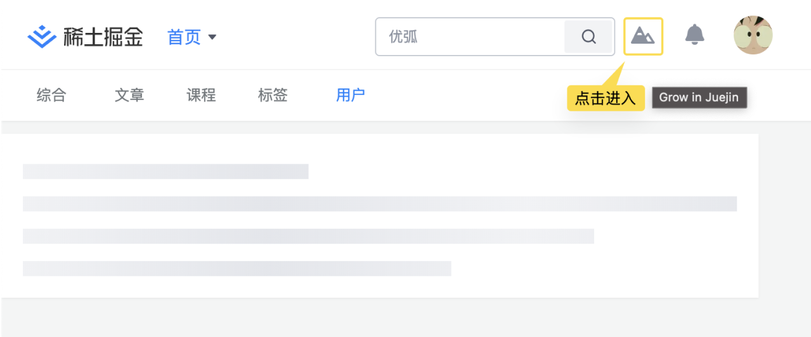

<h1 align="center">Grow in 掘金</h1>

<strong>见证在掘金成长的每一步 🚀</strong>

    

目前形态为浏览器插件，支持 Chromium 系浏览器

## 功能

<table>
    <tr>
        <td>
        展示社区参与度
        </td>
        <td>
追踪创作成长轨迹
        </td>
    </tr>
    <tr>
        <td></td>
        <td></td>
    </tr>
    <tr>
        <td>当前可参与的社区活动</td>
        <td>追踪参与中的活动进度</td>
    </tr>
    <tr>
        <td></td>
        <td></td>
    </tr>
    <tr>
        <td>活动文章合规检测</td>
    </tr>
    <tr>
        <td></td>
    </tr>
</table>

## 使用指南

1. 下载[最新的 Release 包](https://github.com/curly210102/grow-in-juejin/releases/latest/download/extension.zip)

2. 打开浏览器插件管理页面 [chrome://extensions](chrome://extensions)

3. 开启“开发者模式”

4. 解压第一步下载的 zip 包，将解压后的文件夹拖拽至 [chrome://extensions](chrome://extensions) 页面即可使用

5. 使用方法

<table>
<tr>
<td>
<a href="https://juejin.cn">juejin.cn</a>顶部导航栏入口
</td>
<td>
浏览器工具栏入口
</td>
</tr>
<tr>
<td>

</td>
<td>

</td>
</tr>
</table>

<i>备注：Edge 商店已提交审核，等待上架中...</i>

## 反馈&参与

1. 在使用过程中如有问题，欢迎提交 [issue](https://github.com/curly210102/grow-in-juejin/issues/new?labels=bug&template=bug_report.md&title=) 反馈
2. 如果对掘金社区有优化改进的灵感，欢迎提交 [Feature Request](https://github.com/curly210102/grow-in-juejin/issues/new?labels=feature+request)
3. 欢迎掘金社区的同好们提交 PR，一起共创更好用的社区
