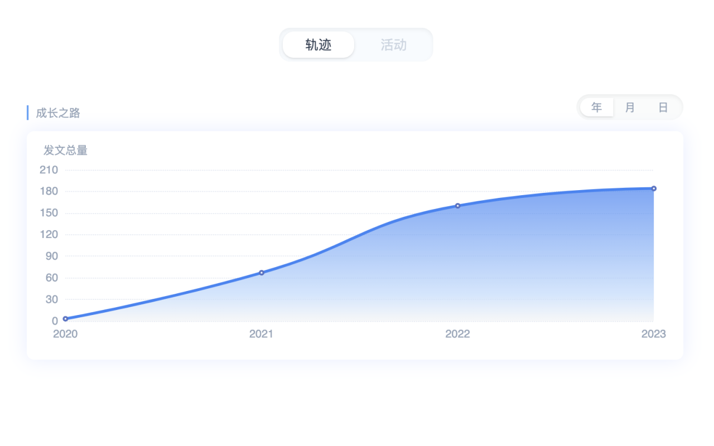

<h1 align="center">Grow in 掘金</h1>

<strong>见证在掘金成长的每一步 🚀</strong>

    

目前形态为浏览器插件，支持 Chromium 系浏览器

## 功能

<table>
    <tr>
        <td>
        展示社区活跃度
        </td>
        <td>
追踪创作成长轨迹
        </td>
    </tr>
    <tr>
        <td></td>
        <td></td>
    </tr>
    <tr>
        <td>当前可参与的社区活动</td>
        <td>追踪参与中的活动进度</td>
    </tr>
    <tr>
        <td></td>
        <td></td>
    </tr>
    <tr>
        <td>活动文章合规检测</td>
    </tr>
    <tr>
        <td></td>
    </tr>
</table>

## 安装插件

- [Chrome 应用商店](https://chrome.google.com/webstore/detail/grow-in-%E6%8E%98%E9%87%91/kiejcjemfigohhmeielfbifkikkiefeg/related?hl=zh-TW&authuser=0)
- [Edge 应用商店](https://microsoftedge.microsoft.com/addons/detail/grow-in-%E6%8E%98%E9%87%91/ookedghbbdhcjopmnhfabdghmkjdoace?hl=en-US)
- [安装包下载](https://gitee.com/curlly-brackets/grow-in-juejin-web-extension/releases/download/v0.3.0/grow-in-juejin.zip)

## 反馈&参与

1. 在使用过程中如有问题，欢迎提交 [issue](https://github.com/curly210102/grow-in-juejin/issues/new?labels=bug&template=bug_report.md&title=) 反馈
2. 如果对掘金社区有优化改进的灵感，欢迎提交 [Feature Request](https://github.com/curly210102/grow-in-juejin/issues/new?labels=feature+request)
3. 欢迎掘金社区的同好们提交 PR，一起共创更好用的社区
